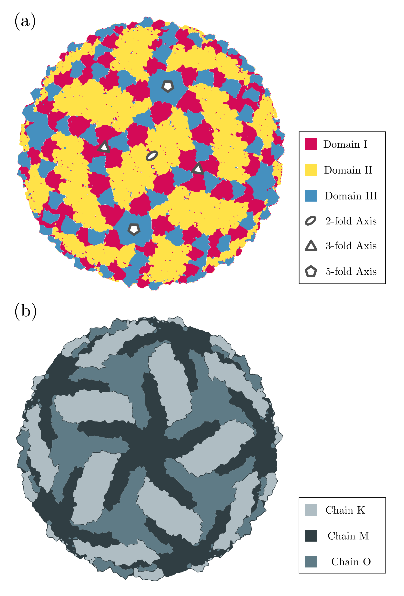

# Dynamics and Specificity in the Microenvironment of the Zika Virus

```@raw html
Camila Assis <b>Tavares</b><sup>1,2</sup>, Martín <b>Soñora</b><sup>3</sup>, Sergio <b>Pantano</b><sup>3</sup>, Leandro <b>Martínez</b><sup>1,2</sup> <br>
```

```@raw html
<span style="font-size:0.8em">
<sup>1</sup> Institute of Chemistry, Universidade Estadual de Campinas (UNICAMP), Campinas, SP, Brazil <br>
<sup>2</sup> Center for Computational Engineering & Science, Universidade Estadual de Campinas (UNICAMP), Campinas, SP, Brazil <br>
<sup>3</sup> Biomolecular Simulations Group, Institut Pasteur de Montevideo, Mataojo 2020, Montevideo, Uruguay<br>
</span>
<br>
```

_Corresponding author:_ [lmartine@unicamp.br](mailto:lmartine@unicamp.br)

This page serves as a complementary resource to the poster _“Dynamics and Specificity in the Microenvironment of the Zika Virus”_, presented at the XXIII Simpósio Brasileiro de Química Teórica.

It provides additional figures, data, and analyses that could not be included in the poster due to space and visual limitations. These materials aim to offer a deeper understanding of the computational approaches, interaction patterns, and molecular dynamics results discussed in the presentation.

## Introduction
The stability and infectivity of viral particles are profoundly influenced by a complex network of interactions with their microenvironment, which includes the lipid bilayer, ions, and water molecules. However, obtaining atomic resolution of these light and dynamic components remains a significant challenge for traditional experimental techniques, such as X-ray crystallography and cryo-electron microscopy, which often provide a static view [^1] [^2]. To overcome these limitations, this study used coarse-grain molecular dynamics simulations to investigate in detail the
distribution and behavior of these elements in the structure of the mature Zika virus. The quantitative analysis, performed with the [ComplexMixtures.jl](https://m3g.github.io/ComplexMixtures.jl) package, focuses on deciphering the specific interactions between the viral envelope proteins and the different solvent components, such as water molecules (WT4) and the lipid bilayer [^3] [^4].

## Computational Details
Coarse-grained molecular dynamics (MD) simulations were carried out to explore the organization and dynamics of the mature Zika virus envelope. The initial coordinates were taken from the cryo-electron microscopy structure deposited in the Protein Data Bank (PDB ID: 6CO8). The complete viral system, including the lipid bilayer and solvent environment, was assembled using [PACKMOL](https://m3g.github.io/packmol/) (version 18.169), ensuring the correct spatial distribution of proteins, lipids, and water molecules.

All molecular entities were described using the SIRAH 2.0 coarse-grained force field, which balances structural accuracy with computational efficiency. Simulations were performed with the GROMACS package (version 2018.4, [http://www.gromacs.org](http://www.gromacs.org)), employing GPU acceleration. Temperature and pressure were maintained at 300 K and 1 bar, respectively, using the V-rescale thermostat and the Parrinello–Rahman barostat.

Nonbonded interactions were calculated using a 12 Å cutoff, and long-range electrostatics were handled via the particle mesh Ewald (PME) approach. Integration of Newton’s equations of motion was achieved using the leapfrog algorithm with an adaptive timestep: 2 fs during equilibration, later increased to 20 fs for production runs. Neighbor lists were updated every 10 steps, and coordinates were recorded every 100 ps for post-simulation analysis.

To characterize the organization of light molecular components—such as water molecules and ions—around the viral envelope, analyses were performed using the [ComplexMixtures.jl](https://m3g.github.io/ComplexMixtures.jl) package. This Julia-based framework enables quantitative assessment of solute–solvent interactions in complex and irregular environments, such as viral membranes.

A central metric in this analysis was the coordination number (CN), which measures how many solvent sites are located within a specified distance from solute atoms. For each frame of the trajectory, the algorithm iterates through all solute–solvent pairs, computing interatomic distances and counting those within a chosen cutoff radius (rc). Each qualifying solvent molecule contributes to the instantaneous CN of the corresponding solute site. The resulting time-resolved CN profiles reveal how solvent density and organization fluctuate around specific protein regions throughout the simulation.

```@raw html
This calculation process is illustrated schematically in Figure X: <br>

• A solute atom (e.g., from the viral envelope protein) is defined as the reference center. <br>

• Distances (r<sub>i</sub>) to surrounding solvent atoms are measured. <br>

• All atoms within r<sub>c</sub> are counted, giving CN = N(r<sub>i</sub> ≤ r<sub>c</sub>). <br>
```

Through this method, we obtained a high-resolution picture of local hydration and ionic structuring around protein domains and membrane regions, enabling quantitative assessment of solvent accessibility and the dynamic heterogeneity of the viral microenvironment.

## Results and Discussion - Extended Analyses

#### Structure of the Virus

```@raw html
<figure style="text-align: center;">
  
  <figcaption>Figure 1. Structural organization of the mature Zika virus envelope. (a) Top view of the viral surface highlighting the three structural domains of the envelope (E) protein: Domain I (magenta), Domain II (yellow), and Domain III (blue). The symmetry axes of the icosahedral arrangement are indicated as 2-fold (ellipse), 3-fold (triangle), and 5-fold (pentagon). (b) Equivalent representation showing the trimeric organization of the E protein units, colored by chain identifier (K, M, and O), which form the repeating structural units across the viral surface.</figcaption>
</figure>
```

```@raw html
<figure style="text-align: center;">
  
  <figcaption>Figure 2. Structural organization of the E–M protein interface in the Zika virus envelope. Highlighted elements correspond to the amphipathic (EH) and transmembrane (ET) helices of the envelope (E) protein and the membrane (MH) helices of the M protein. Each region is labeled according to its designation (EH-1 to EH-3, ET-1 to ET-2, and MH-1 to MH-3). These helices play key roles in anchoring the E protein to the membrane and mediating interactions within the viral lipid environment.</figcaption>
</figure>
```

### WT4 Molecules and E Protein

```@raw html
<figure style="text-align: center;">
  
  <figcaption>Figure 3. Time-dependent assessment of the coordination number of WT4 water molecules for chains K, M, and O (E-protein).</figcaption>
</figure>
```

```@raw html
<figure style="text-align: center;">
  
  <figcaption>Figure 4. Temporal variation in the number of WT4 water molecules coordinated to E-protein chains L, N, and P, illustrating differences in hydration dynamics among subunits..</figcaption>
</figure>
```

### Lipid Bilayer and M Protein

#### POPC

```@raw html
<figure style="text-align: center;">
  
  <figcaption>Figure 5. Temporal variation in the number of WT4 water molecules coordinated to E-protein chains L, N, and P, illustrating differences in hydration dynamics among subunits..</figcaption>
</figure>
```


#### POPE

#### POPS

## Acknowledgments

The authors acknowledge the financial support of FAPESP (2013/08293-7, 2018/24293-0 and 2023/14353-4). Research developed with the assistance of computing resources of COARACI (2019/17874-0) provided by Center for Computational Engineering & Science (CCES - Unicamp).

```@raw html
<a href="http://m3g.iqm.unicamp.br">
    
</a>
```

 _This work was carried out by the **M3G Group** at Unicamp in collaboration with the **Biomolecular Simulations Group** at the Institut Pasteur de Montevideo._

 ## References

[^1]: Sevvana, Madhumati et al. Structure, 2018, 26(9), 1169-1177.
[^2]: Klein, Florencia et al. Journal of Structural Biology, 2023, 215(3), 107985.
[^3]: Soñora, Martín et al. Journal of Chemical Information and Modeling, 2021, 61(1), 408-422.
[^4]: Martínez, Leandro. Journal of Molecular Liquids. 2022, 347, 117945.